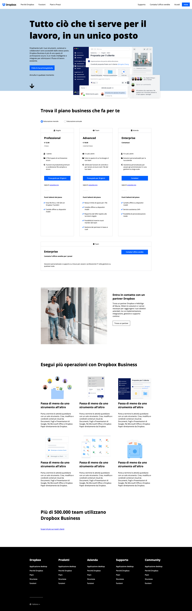

Decimo Esercizio Classe #137 - Boolean
===
Studente: Fabio Ferrero

---
# English

## Target of the project:
Replicate Dropbox Homepage from screenshots using HTML and CSS knowledge
---
# Italiano

## Obiettivo del progetto:
Replicare la homepage di Dropbox, usando le conoscenze di HTML\CSS partendo da uno screenshot

---

---

---
<strong>Lo screenshot fornito dal coach è il seguente:</strong>

